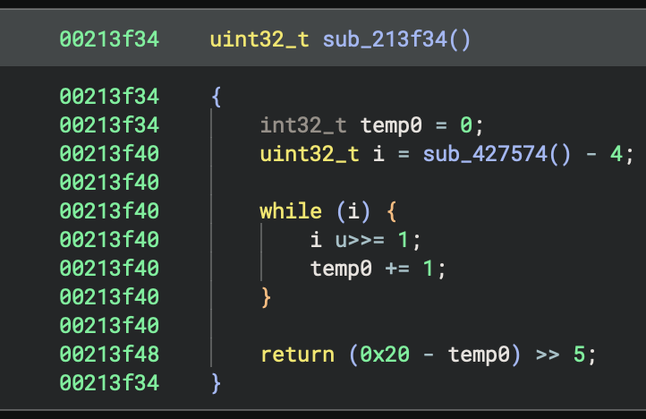

# Lift ARMv7 clz / lsr to equality tests

This Binary Ninja plug-in detects the explicit loops that result when the ARMv7 architecture
support lifts clz / lsr instruction sequences. They are rewritten into equality comparisons when
it makes sense (sub / clz / lsr) and into logical negations otherwise.

| Disassembly | Before | After |
|----------|--------|-------|
|  |  |  |

## Supported Binary Ninja versions

Only recent versions of Binary Ninja 5.1-dev are supported.

## Installation

```
git clone https://github.com/bdash/bn-armv7-clz-eq.git
cd bn-armv7-clz-eq
cargo build --release
ln -sf $PWD/target/release/libbn_armv7_clz_eq.dylib ~/Library/Application\ Support/Binary\ Ninja/plugins/
```

## Configuration

The function analysis provided by this plug-in is enabled by default. It can be disabled on a per-function
basis via the `Function Analysis` context menu, or globally via the `bdash.armv7-equality-test setting in
Binary Ninja's settings.

## Limitations

This currently only recognizes this pattern when full 32-bit registers are used.

## Background

Compilers for ARMv7 often emit an instruction sequence like the following for an equality comparison of the form `r2 == r0`:
```
00182aec     0  000062e0   rsb     r0, r2, r0
00182af0     0  100f6fe1   clz     r0, r0
00182af4     0  a002a0e1   lsr     r0, r0, #0x5
```

In the more general case, a logical negation may result in an instruction sequence like:
```
00181934     0  100f6fe1   clz     r0, r0
00181938     0  a002a0e1   lsr     r0, r0, #0x5
```

At present, Binary Ninja's ARMv7 support lifts the `clz` into a loop that counts the leading ones, and then uses a subtraction to convert that into the number of leading zeroes:
```
   5 @ 00181934     0  temp0.d = 0
   6 @ 00181934     0  temp1.d = r0
   7 @ 00181934     0  goto 8

   8 @ 00181934     0  if (temp1.d != 0) then 9 else 12

   9 @ 00181934     0  temp1.d = temp1.d u>> 1
  10 @ 00181934     0  temp0.d = temp0.d + 1
  11 @ 00181934     0  goto 8

  12 @ 00181934     0  r0 = 0x20 - temp0.d
```

When lifted further into HLIL the explicit loop remains, obfuscating the original logic of the program:
```
00181934        int32_t temp0 = 0
00181934        uint32_t i = *(arg1 + (zx.d(data_63a73c) << 2) + 0x5c)
00181934        
00181934        while (i != 0) {
00181934            i u>>= 1
00181934            temp0 += 1
00181934        }
00181934        
0018193c        return (0x20 - temp0) u>> 5
```

https://github.com/Vector35/binaryninja-api/issues/5097 tracks improving the lifting in Binary Ninja's ARMv7 architecture support.
